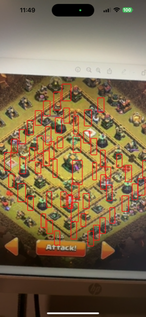

# React Native Clash of Clans YOLOv5 + CoreML

Experiment repo for using YOLOv5 w/ CoreML in react native using the react native vision camera library.

Repo started using: https://docs.expo.dev/get-started/create-a-new-app/

## Packages

- [react-native-vision-camera](https://github.com/mrousavy/react-native-vision-camera)
- [expo](https://docs.expo.dev/get-started/create-a-new-app/)

## Example:

### Screenshot:

### GIF:

